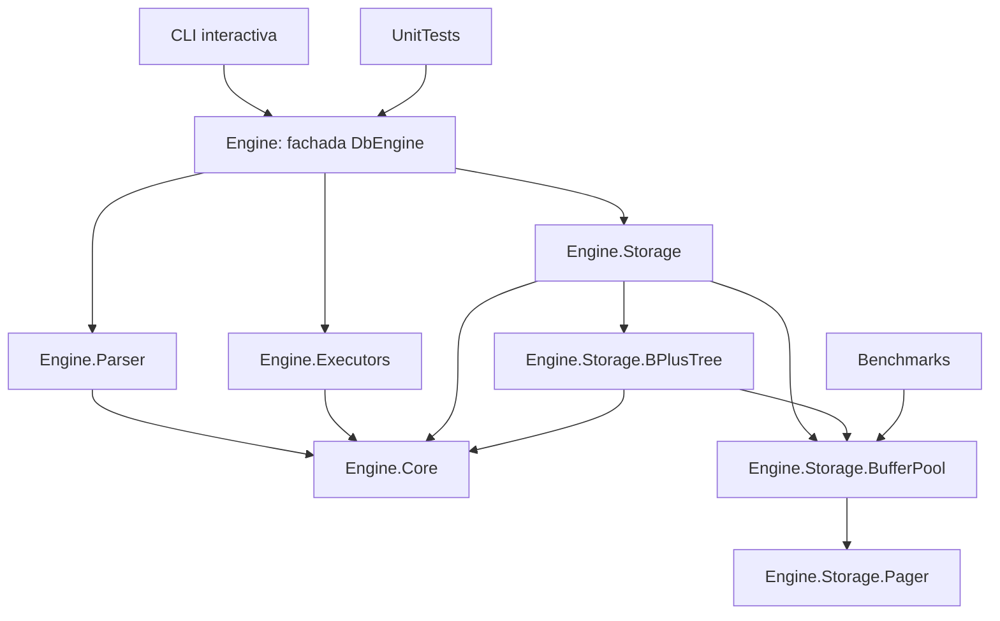

# ResilentDB

ResilentDB es una base de datos didáctica escrita en C#/.NET. Su objetivo es hacer visible cómo se conectan un parser SQL pequeño, un ejecutor de comandos, un catálogo persistente, un buffer pool y un índice B+Tree paginado. No pretende competir con SQLite ni ser segura para producción: prioriza que cada responsabilidad y cada invariante se puedan estudiar y probar.

## Qué permite hacer

El lenguaje implementa un subconjunto de SQL con `CREATE TABLE`, `INSERT`, `SELECT`, `UPDATE` y `DELETE`, incluyendo filtros sencillos (`=`, `<`, `>`, `<=`, `>=`). Cada tabla requiere una sola clave primaria `INTEGER`; los tipos habituales del ejemplo son `INTEGER` y `TEXT`.

```sql
CREATE TABLE users (id INTEGER PRIMARY KEY, name TEXT);
INSERT INTO users VALUES (1, 'Ada');
SELECT name FROM users WHERE id = 1;
UPDATE users SET name = 'Grace' WHERE id = 1;
DELETE FROM users WHERE id = 1;
```

El parser produce un AST de sentencias. Los ejecutores operan sobre contratos de Core y usan el índice primario para buscar, insertar, modificar y borrar filas. Las filas y el catálogo sobreviven al cierre y a la reapertura del archivo.

## Arquitectura



`Engine.Core` contiene modelos, AST, resultados tipados y los contratos `IExecutionContext`/`IPrimaryKeyIndex`. `Engine` es la fachada pública: crea Storage, carga el esquema, valida índices y conecta Parser con Executors. Las bibliotecas pueden compilarse y estudiarse por separado.

## Guías por componente

Para profundizar en una parte concreta, cada proyecto tiene una guía propia:

- [Pager y formato de archivo paginado](Engine/Storage/Pager/README.md): cabecera, IDs, offsets, lectura y asignación de páginas.
- [Buffer pool y políticas de reemplazo](Engine/Storage/BufferPool/README.md): pins, dirty pages, Clock, LRU, Direct y FullCache.
- [B+Tree paginado](Engine/Storage/BPlusTree/README.md): búsqueda, range scans, split/merge, overflow pages y free list.
- [Storage y catálogo](Engine/Storage/README.md): mapa de tablas a índices, validación y orden de persistencia.
- [Parser y AST](Engine/Parser/README.md): gramática soportada y estrategia de análisis.
- [Ejecución de sentencias](Engine/Executors/README.md): dispatcher, validaciones y uso del índice por los ejecutores.
- [Contratos y modelos compartidos](Engine/Core/README.md): AST, resultados tipados e interfaces entre módulos.
- [Fachada del motor](Engine/README.md): ciclo de vida y coordinación de los proyectos.
- [CLI](Cli/README.md): interacción, comandos y presentación de resultados.
- [Tests](UnitTests/README.md): cobertura y ejecución de la suite.
- [Benchmark](Benchmarks/README.md): metodología y comparación de políticas de caché.

## Decisiones de diseño

### Páginas y Pager

El archivo usa páginas de tamaño fijo, 4096 bytes por defecto. La página 0 contiene una cabecera de 16 bytes (`magic`, versión, tamaño de página y número de páginas); la página 1 guarda el catálogo y las páginas desde la 2 son asignables. Un ID se traduce directamente al desplazamiento `PageId * PageSize`, una representación sencilla de inspeccionar y probar.

`Pager` implementa lectura/escritura exacta de páginas y asignación secuencial al final del archivo. Mantiene en caché la cabecera, valida versión y límites, y sincroniza con `Flush(true)`. El formato incluye versión para que cambios futuros puedan detectar incompatibilidad.

### Buffer pool

El buffer pool desacopla el acceso lógico a páginas del archivo. `ClockBufferPool` usa la política Clock (segunda oportunidad): un bit de referencia evita expulsar inmediatamente páginas usadas recientemente; una página fijada nunca se expulsa y las dirty se escriben al salir. Se eligió por ofrecer un reemplazo acotado y más simple que mantener una lista LRU en cada acceso. También hay implementaciones Direct, LRU y FullCache para comparar políticas.

`ReadPage` devuelve una copia; `FetchPage` fija el frame interno y requiere `UnpinPage`; `FetchPageHandle` encapsula ese ciclo con `IDisposable`.

### Índice B+Tree

El índice mantiene claves ordenadas en hojas y claves separadoras en nodos internos. Todas las hojas quedan al mismo nivel y enlazadas entre sí: la búsqueda es logarítmica y los rangos recorren las hojas en orden. Las inserciones hacen split y promueven separadores; las eliminaciones redistribuyen o fusionan hermanos y pueden reducir la raíz.

Los valores pequeños se almacenan en la hoja. Payloads grandes se dividen en overflow pages; páginas liberadas se encadenan en una free list para reutilizarlas. Las claves y longitudes del formato se escriben en little-endian. `Validate()` comprueba estructura, separadores, enlaces, overflow y free list.

### Parser y ejecución

El parser es deliberadamente pequeño: usa parsers especializados y una pasada que no corta por `;` dentro de comillas para separar comandos. No es una gramática SQL completa ni implementa escapes SQL avanzados. Executors separa la validación y ejecución de cada tipo de sentencia; el dispatcher los selecciona por tipo de AST.

## Persistencia y límites

`Storage.Save()` fuerza primero las páginas dirty pendientes y publica después el catálogo. El buffer pool no ordena por tipo las páginas del B+Tree y una expulsión puede escribir antes de `Save()`. No hay WAL, transacciones ni recuperación tras una caída: el orden reduce ciertos riesgos, pero **no garantiza atomicidad**.

El catálogo ocupa una página; el número de tablas/índices queda limitado por su capacidad. Solo se soporta un índice primario por tabla y no hay índices secundarios, joins, constraints generales ni concurrencia entre procesos sobre un mismo archivo.

## Ejecutar y comprobar

Se requiere .NET 10 SDK.

```sh
dotnet build Engine/Engine.csproj
dotnet test UnitTests/UnitTests.csproj
dotnet run --project Cli/Cli.csproj
dotnet run --project Benchmarks/Benchmarks.csproj
```

El CLI crea `basededatos.mdb` en el directorio de trabajo. `.read <archivo.sql>` ejecuta un archivo y `.exit` termina la sesión. [UnitTests](UnitTests/README.md) documenta la cobertura; [Benchmarks](Benchmarks/README.md) explica el experimento de políticas de caché.